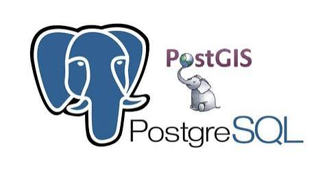
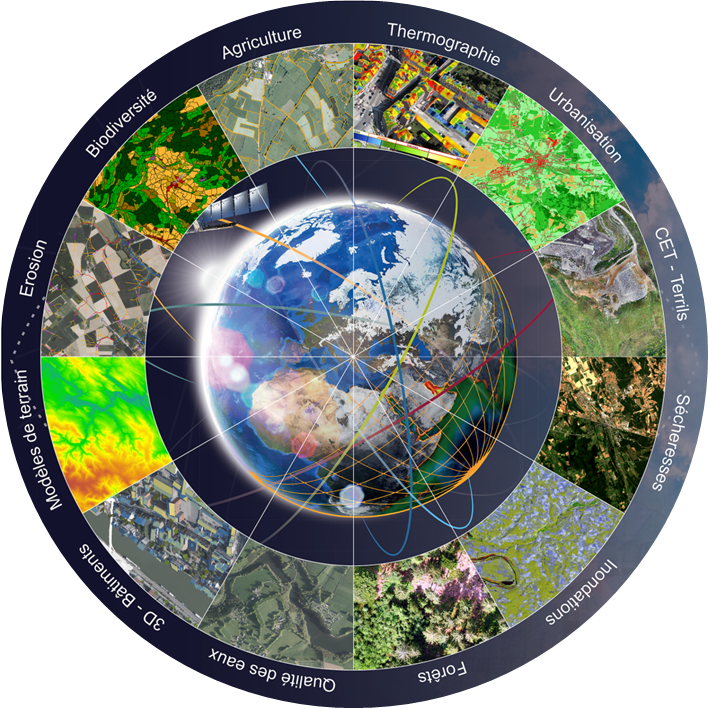
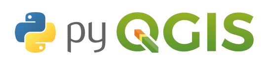
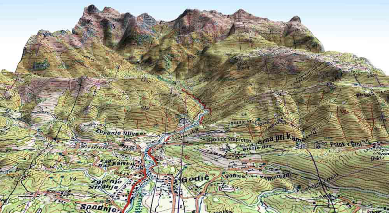

# Documentation CPGEOM
{: .fs-9 }

Notes de cours, exercices, fiches de révision et ressources techniques pour la formation **Chef de projet géomatique**.
{: .fs-6 .fw-300 }

<section class="cpgeom-hero">
  

    
Formation CPGEOM

    <h2>Un espace clair pour apprendre, pratiquer et retrouver les notions importantes.</h2>
    

      Cette documentation rassemble progressivement les contenus utiles pour conduire un projet géomatique :
      méthodologie, données spatiales, PostgreSQL/PostGIS, QGIS, Python, télédétection et contrôle qualité.
    

    

      <a class="btn btn-primary" href="#sommaire-general">Explorer les modules</a>
      <a class="btn" href="#parcours-de-lecture">Suivre un parcours</a>
    

  

  
</section>

## Repères rapides

  

    <strong>8 modules</strong>
    Cours organisés par thèmes pour naviguer rapidement.
  

  

    <strong>1 fil rouge</strong>
    Passer du cadrage projet à la production géomatique.
  

  

    <strong>Usage pro</strong>
    Conserver une base de connaissances réutilisable.
  

## Sommaire général

  <a class="cpgeom-card" href="{{ '/gp.html' | relative_url }}">
    
    

      Projet
      <h3>Gestion de projet</h3>
      
Cadrage, acteurs, planification, suivi, risques, livrables et communication projet.

    

  </a>

  <a class="cpgeom-card" href="{{ '/bd.html' | relative_url }}">
    
    

      Base de données
      <h3>PostgreSQL &amp; PostGIS</h3>
      
SQL, modélisation, schémas, géométries, index spatiaux et administration BDD.

    

  </a>

  <a class="cpgeom-card" href="{{ '/cq.html' | relative_url }}">
    
Contrôle qualité

    

      Qualité
      <h3>Contrôle qualité</h3>
      
Méthodes de validation, vérification des données et suivi de la fiabilité.

    

  </a>

  <a class="cpgeom-card" href="{{ '/fe.html' | relative_url }}">
    
Formats SIG

    

      Formats
      <h3>Formats ESRI</h3>
      
Shapefile, geodatabase, formats d'échange et bonnes pratiques d'interopérabilité.

    

  </a>

  <a class="cpgeom-card" href="{{ '/tel.html' | relative_url }}">
    
    

      Raster
      <h3>Télédétection</h3>
      
Images satellites, bandes spectrales, indices, classification et traitements raster.

    

  </a>

  <a class="cpgeom-card" href="{{ '/pp.html' | relative_url }}">
    
    

      Automatisation
      <h3>Python &amp; PyQGIS</h3>
      
Scripts, traitements QGIS, bibliothèques géomatiques et automatisation des tâches.

    

  </a>

  <a class="cpgeom-card" href="{{ '/com.html' | relative_url }}">
    
Données

    

      Interop
      <h3>Données &amp; interopérabilité</h3>
      
Cycle de vie des données, VRT, métadonnées, droit informatique et partage.

    

  </a>

  <a class="cpgeom-card" href="{{ '/3d.html' | relative_url }}">
    
    

      SIG
      <h3>Géomatique, SIG &amp; 3D</h3>
      
QGIS, projections, couches, analyse spatiale, cartographie et représentation 3D.

    

  </a>

## Parcours de lecture

| Étape | Objectif | Modules conseillés |
|---|---|---|
| 1 | Comprendre le besoin et cadrer le travail | [Gestion de projet]({{ '/gp.html' | relative_url }}) |
| 2 | Structurer les données et les formats | [PostGIS]({{ '/bd.html' | relative_url }}) · [Formats ESRI]({{ '/fe.html' | relative_url }}) |
| 3 | Contrôler et fiabiliser les données | [Contrôle qualité]({{ '/cq.html' | relative_url }}) · [Données & interopérabilité]({{ '/com.html' | relative_url }}) |
| 4 | Analyser, automatiser et produire | [Python & PyQGIS]({{ '/pp.html' | relative_url }}) · [Télédétection]({{ '/tel.html' | relative_url }}) |
| 5 | Valoriser les résultats | [Géomatique, SIG & 3D]({{ '/3d.html' | relative_url }}) |

## Ce que je centralise ici

- Des notes de cours classées par thématique.
- Des exercices et travaux pratiques pour retrouver rapidement les manipulations.
- Des fiches de révision pour consolider les notions importantes.
- Des ressources techniques sur QGIS, PostgreSQL/PostGIS, Python et les données spatiales.
- Une trace professionnelle des compétences développées pendant la formation.

## Compétences travaillées

| Compétence | Niveau visé |
|---|---|
| Gestion de projet géomatique | Intermédiaire à avancé |
| PostgreSQL / PostGIS | Intermédiaire |
| QGIS et analyse spatiale | Avancé |
| Python et PyQGIS | Progressif |
| Télédétection | Intermédiaire |
| Contrôle qualité des données | Intermédiaire |
| Documentation technique | Professionnel |

## Ressources utiles

| Outil | Utilisation dans la formation |
|---|---|
| QGIS | Consultation, analyse et production cartographique |
| PostgreSQL / PostGIS | Stockage, requêtes spatiales et administration de données |
| Python / PyQGIS | Automatisation et traitements répétitifs |
| GitHub Pages | Publication et structuration de la documentation |
| Markdown | Rédaction claire, légère et versionnable |

> Cette page sert de point d'entrée. Elle évoluera au fur et à mesure de l'ajout des cours, exercices et projets.
