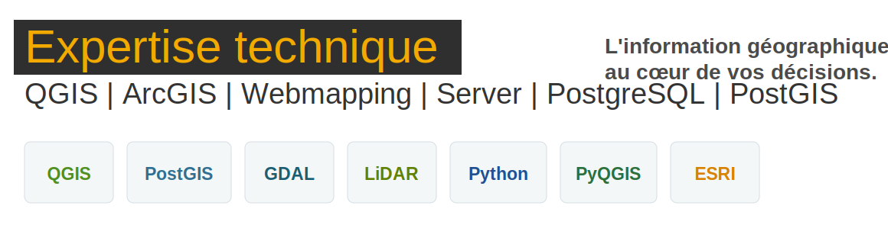

# Bienvenue sur la documentation en Géomatique

---

## Auteur

**Chafii Abdi Ahmed**

Documentation développée pour organiser les ressources, méthodes et bonnes pratiques utilisées dans les projets SIG et géomatiques.

Ce site rassemble les connaissances utiles pour la production, la gestion, le contrôle et l'analyse des données géographiques.

## Objectifs du site

- Centraliser les connaissances et outils géomatiques.
- Améliorer l'accès aux données, aux procédures et aux référentiels.
- Structurer les contenus de formation de manière claire.
- Faciliter la modification du site grâce à des fichiers Markdown simples.

## Quelques contenus disponibles

| Bloc | Contenu |
|---|---|
| Gestion de projet | Cadrage, périmètre, tâches, risques et gouvernance. |
| Base de données | Introduction BDD, administration PostgreSQL et PostGIS. |
| Contrôle qualité | ISO 19115, qualité, traçabilité et aspect juridique. |
| Formats ESRI | Shapefile, géodatabase et points d'attention. |
| Télédétection | Optique, LiDAR, radar et usages géomatiques. |
| Python & PyQGIS | Bases Python, scripts QGIS et automatisation. |
| Données & Interopérabilité | VRT, droits, cycle de données et métadonnées. |

!!! note "Modification"
    Pour modifier le contenu, ouvre les fichiers `.md` dans le dossier `source/`.
    Le menu est organisé dans le fichier `mkdocs.yml`.
